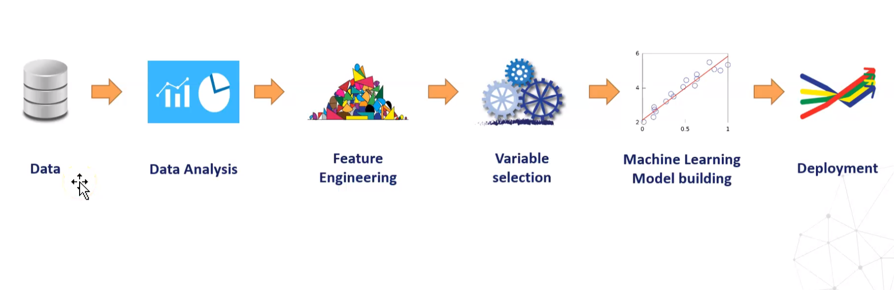
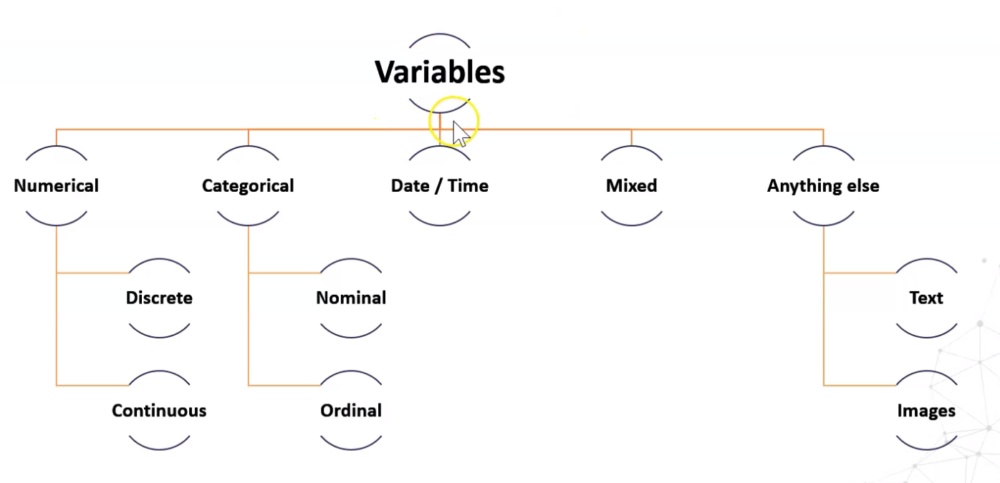
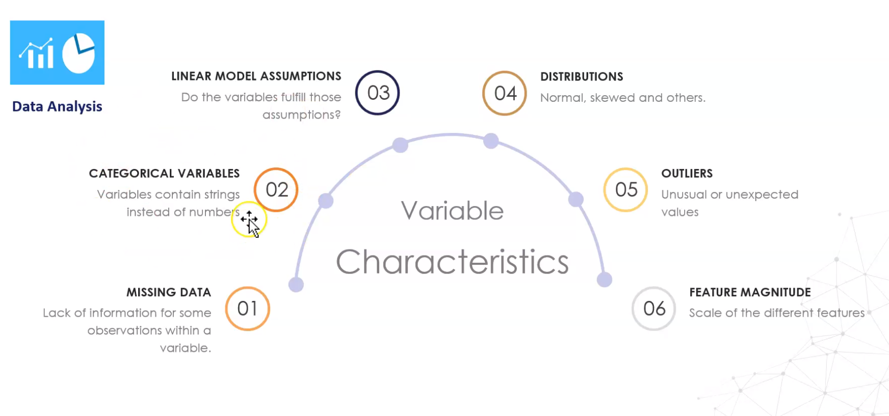

# Feature-Engineering
Machine Learning Feature Engineering Techniques.

#### BIG PICTURE

A general machine learning project follows the following steps.

Data Analysis:

- Feature Creation: 
  
  - Extracting features from dates 
  - Extracting features from Mixed variables 
  - Missing data imputation 
  - Categorical variable imputation 
  - Numerical variable transformation 
  - Discretization 
  - Outlier Handling 
  - Feature Scaling 

## Feature Engineering refers to: ##

- [x] Missing data imputation
- [x] Categorical variable encoding
- [x] Numerical variable transformation
- [x] Discretization
- [x] Engineering of datetime variables
- [x] Engineering of coordinates — GIS data
- [x] Feature extraction from text
- [x] Feature extraction from images
- [x] Feature extraction from time series
- [x] New feature creation by combining existing variables

### Following Content have been used in this repo: ##

- [x] Missing data imputation: 
  - mean
  - median
  - mode
  - arbitrary
  - end of tail and random sample imputation
  - multivariate imputation.

- [x] Categorical variable encoding: 
  - one-hot
  - ordinal
  - mean encoding
  - weight-of evidence
  - binarization, 
  - feature hashing.

- [x] Numerical variable transformation: 
  - logarithmic
  - reciprocal
  - exponential
  - Box-Cox
  - Yeo-Johnson transformations.

- [x]Variable discretization: 
  - equal width discretization
  - equal-frequency discretization
  - k-means discretization
  - decision trees discretization

- [x] Outlier removal: 
  - trimming
  - capping
  - Winsorization

- [x] Feature Scaling: 
  - standardization
  - MinMax scaling
  - robust scaling
  - norm scaling

- [x]Engineering of datetime variables: 
  - extracting features from day, month and year parts, and capturing elapsed time including in different time zones.

- [x] Engineering of mixed numerical and categorical variables

- [x]Compared code implementation with different available open source Python packages, like Scikit-learn, and Category encoders.